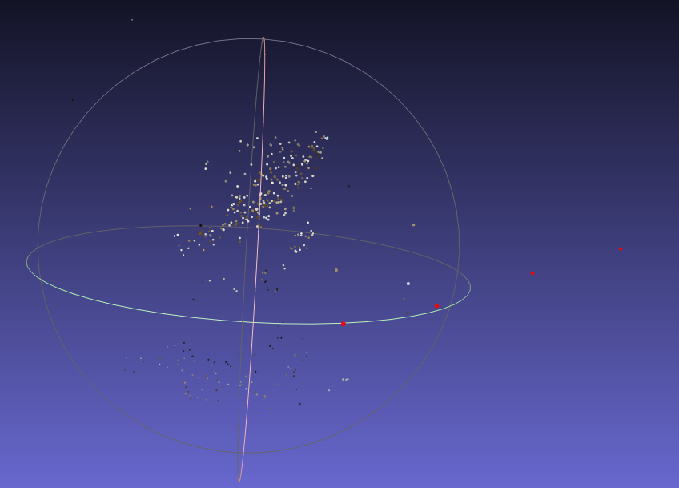
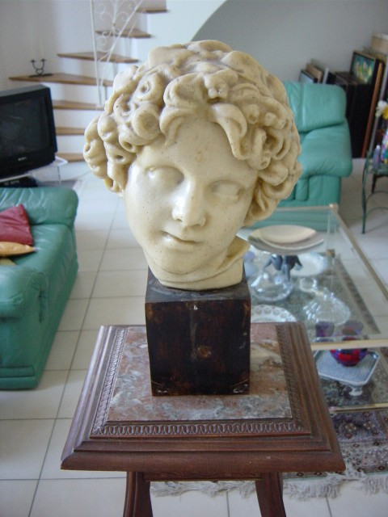

## Cuda Photogrammetry

### Structure from motion
1 | 2 | 3 |
:------:|:-------:|:------:|
  |   |  |

| Sparse point cloud |
:--------:|
| |
<b></b>

### Multiple view RGBD dense point cloud
1 | 2 | 3 |
:------:|:-------:|:------:|
  |   |  |

| Dense point cloud |
:--------:|
| |
<b></b>

### Monodepth using TensorRT with MiDaS v2 small model
1 | 2 |
:------:|:-------:|
  |   |
<b></b>

### Surface reconstruction using monodepth and surfels triangulation
1 | 2 |
:------:|:-------:|
  |   |
<b></b>

### Cuda SGM stereo estimation
1 | 2 |
:------:|:-------:|
  |   |
<b></b>


### Build project
```
mkdir build
cd build
cmake -DCMAKE_BUILD_TYPE=Release ..
cmake --build build -j $(nproc)
```

### Tools:
* G++-8
* CMake>=3.22
* Cuda>=10.2
* TensorRT>=8.2

### Used third-party library:
* [Eigen 3.3.4](https://eigen.tuxfamily.org)
* [OpenCV 4.5.5](https://github.com/opencv/opencv)
* [Boost 1.65.1](https://www.boost.org/)
* [PCL 1.8](https://pointclouds.org)
* [Glog 0.5.0](https://github.com/google/glog)
* [Gflags 2.2.1](https://github.com/gflags/gflags)
* [Ceres-Solver](http://ceres-solver.org/)
* [Sophus](https://github.com/strasdat/Sophus)
* [CudaSift](https://github.com/SokratG/CudaSift/tree/fix-cmake)

